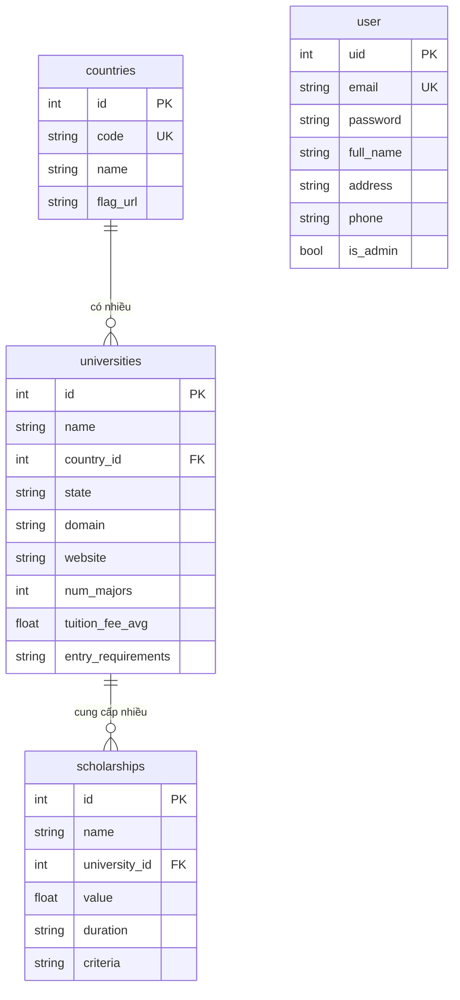

# 1. Giới thiệu
- Dự án xây dựng ứng dụng cung cấp thông tin về các trường đại học nước ngoài, sử dụng tkinter và sqlite3
- Các chức năng chính:
+ Thêm, sửa, xóa thông tin các nước, các trường đại học (admin)
+ Quản lý thông tin người dùng (admin)
+ Trực quan hóa, so sánh thông tin các trường
+ Tìm kiếm, xem thông tin các nước, các trường
+ Chatbot AI hỗ trợ gợi ý trường đại học phù hợp với thông tin người dùng cung cấp
+ Đăng ký, đăng nhập, đăng xuất

# 2. Cấu trúc dự án
- Dự án bao gồm các file:
+ app.py: file chính chạy ứng dụng
+ auth.py: quản lý xác thực đăng nhập, đăng ký
+ countries_tab.py: tab quản lý thông tin các nước
+ database.py: khởi tạo, kết nối database, các hàm quản lý thông tin người dùng (insert, delete, register,...), khởi tạo tài khoản admin
+ fetch_data_new_version.ipynb: file notebook khởi tạo database, lấy thông tin các nước và một số thông tin các trường đại học từ API (chạy lần đầu)
+ placeholder_tabs.py: hai tab so sánh (trực quan hóa) và chatbot (về sau sẽ tách riêng thành hai tab, hiện đang gộp)
+ universities_db.db: file database sqlite3
+ universities.py: tab quản lý thông tin các trường đại học
+ user_management.py: tab quản lý thông tin cá nhân user

# 3. Cấu trúc database
## Các bảng
### 1. `user` – Người dùng hệ thống
| Trường         | Kiểu dữ liệu       | Ràng buộc                  | Mô tả                          |
|----------------|--------------------|----------------------------|--------------------------------|
| `uid`          | INTEGER            | PRIMARY KEY AUTOINCREMENT  | ID người dùng                  |
| `email`        | TEXT               | UNIQUE NOT NULL            | Email đăng nhập (duy nhất)     |
| `password`     | TEXT               | NOT NULL                   | Mật khẩu (đã hash)             |
| `full_name`    | TEXT               |                            | Họ và tên                      |
| `address`      | TEXT               |                            | Địa chỉ                        |
| `phone`        | TEXT               |                            | Số điện thoại                  |
| `is_admin`     | BOOLEAN            | DEFAULT 0                  | Quyền admin (0 = user, 1 = admin) |

### 2. `countries` – Quốc gia
| Trường       | Kiểu dữ liệu | Ràng buộc              | Mô tả                          |
|--------------|--------------|------------------------|--------------------------------|
| `id`         | INTEGER      | PRIMARY KEY AUTOINCREMENT | ID quốc gia                 |
| `code`       | TEXT         | UNIQUE NOT NULL        | Mã quốc gia (VD: US, VN, AU)   |
| `name`       | TEXT         | NOT NULL               | Tên quốc gia                   |
| `flag_url`   | TEXT         |                        | Link ảnh cờ quốc gia           |

### 3. `universities` – Trường đại học
| Trường                | Kiểu dữ liệu | Ràng buộc                          | Mô tả                                                              |
|-----------------------|--------------|------------------------------------|--------------------------------------------------------------------|
| `id`                  | INTEGER      | PRIMARY KEY AUTOINCREMENT          | ID trường                                                          |
| `name`                | TEXT         | NOT NULL                           | Tên trường                                                         |
| `country_id`          | INTEGER      | FOREIGN KEY → countries(id)        | Quốc gia trường thuộc về                                           |
| `state`               | TEXT         |                                    | Bang/Tỉnh (nếu có)                                                 |
| `domain`              | TEXT         |                                    | Domain email chính thức (vd: harvard.edu)                          |
| `website`             | TEXT         |                                    | Website chính thức                                                 |
| `num_majors`          | INTEGER      |                                    | Số lượng ngành học                                                 |
| `tuition_fee_avg`     | REAL         |                                    | Học phí trung bình/năm (USD)                                       |
| `entry_requirements`  | TEXT         |                                    | Yêu cầu đầu vào (IELTS, GPA, v.v.), lưu dưới dạng chuỗi json       |

### 4. `scholarships` – Học bổng
| Trường         | Kiểu dữ liệu | Ràng buộc                             | Mô tả                                |
|----------------|--------------|---------------------------------------|--------------------------------------|
| `id`           | INTEGER      | PRIMARY KEY AUTOINCREMENT             | ID học bổng                          |
| `name`         | TEXT         | NOT NULL                              | Tên học bổng                         |
| `university_id`| INTEGER      | FOREIGN KEY → universities(id)        | Trường cung cấp học bổng             |
| `value`        | REAL         |                                       | Giá trị học bổng (USD hoặc %)        |
| `duration`     | TEXT         |                                       | Thời hạn (1 năm, 4 năm, toàn khóa…)  |
| `criteria`     | TEXT         |                                       | Tiêu chí xét học bổng                |

---

## Sơ đồ ERD (Entity Relationship Diagram)

# 4. Hướng dẫn cài đặt
Bước 1: Clone code về local từ branch tuan: git clone -b tuan --single-branch https://github.com/Atunnah/Study-Abroad-Information-Comparison-App
Bước 2: Chạy file app.py
Bước 3: Phát triển các chức năng trong các tab như mô tả ở phía trên

