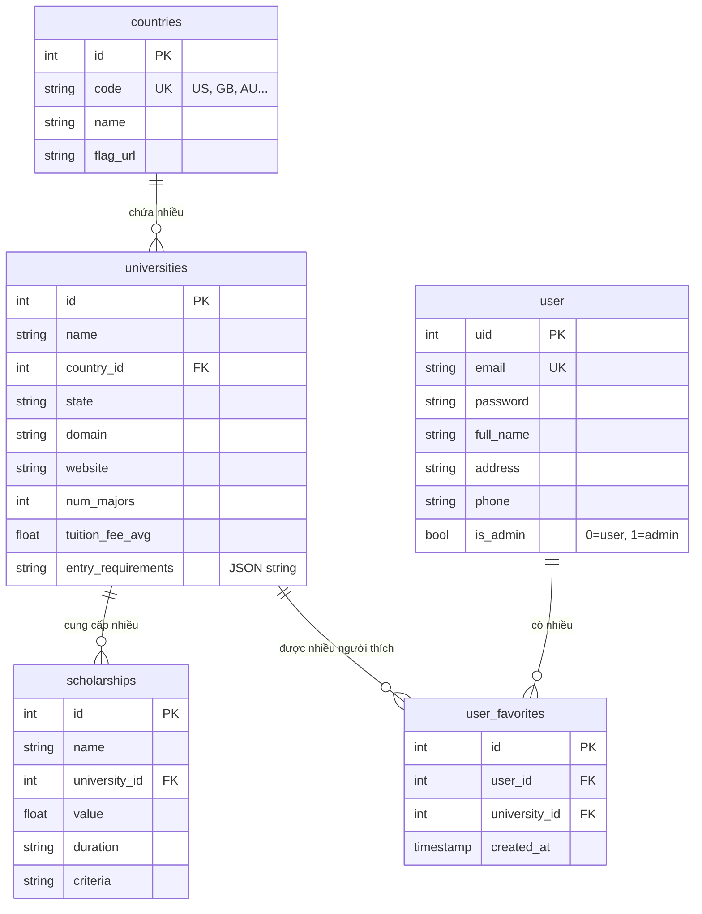

# Study Abroad Information & Comparison App  
**Ứng dụng tư vấn du học – Tìm kiếm, so sánh trường đại học & học bổng quốc tế**

## 1. Giới thiệu dự án

Ứng dụng desktop được xây dựng bằng **Python + Tkinter + SQLite3**, giúp người dùng:
- Tìm kiếm thông tin các trường đại học nước ngoài
- So sánh học phí, yêu cầu đầu vào, số lượng ngành học
- Xem danh sách học bổng theo trường
- Nhận gợi ý trường phù hợp qua **Chatbot AI**
- Quản lý thông tin quốc gia, trường học, người dùng (dành cho Admin)

### Chức năng chính
- Đăng ký / Đăng nhập / Đăng xuất
- Quản lý người dùng (Admin)
- Thêm / Sửa / Xóa thông tin Quốc gia & Trường đại học (Admin)
- Tìm kiếm & lọc trường theo nhiều tiêu chí
- Trực quan hóa & so sánh các trường (biểu đồ)
- Chatbot AI gợi ý trường phù hợp
- Xem chi tiết học bổng của từng trường

## 2. Cấu trúc thư mục dự án

```
Study-Abroad-Information-Comparison-App/
├── app.py                         # File chính khởi chạy ứng dụng
├── auth.py                        # Xử lý đăng ký, đăng nhập, đăng xuất
├── database.py                    # Kết nối DB, khởi tạo bảng, tài khoản admin mặc định
├── countries_tab.py               # Tab quản lý quốc gia (CRUD - Admin)
├── universities.py                # Tab quản lý trường đại học (CRUD - Admin)
├── user_management.py             # Tab quản lý thông tin người dùng (Admin)
├── placeholder_tabs.py            # Tab So sánh (Visualization) + Chatbot (sẽ tách riêng sau)
├── fetch_data_new_version.ipynb   # Notebook lấy dữ liệu API & khởi tạo DB lần đầu
├── universities_db.db             # File database SQLite (tự tạo nếu chưa có)
└── README.md                      # Tài liệu dự án
```


## 3. Cấu trúc Cơ sở dữ liệu (SQLite)

### Các bảng chính

#### 1. `user` – Người dùng hệ thống
| Trường         | Kiểu dữ liệu       | Ràng buộc                       | Mô tả                              |
|----------------|--------------------|---------------------------------|------------------------------------|
| `uid`          | INTEGER            | PRIMARY KEY AUTOINCREMENT       | ID người dùng                      |
| `email`        | TEXT               | UNIQUE NOT NULL                 | Email đăng nhập                    |
| `password`     | TEXT               | NOT NULL                        | Mật khẩu (đã được hash)            |
| `full_name`    | TEXT               |                                 | Họ tên                             |
| `address`      | TEXT               |                                 | Địa chỉ                            |
| `phone`        | TEXT               |                                 | Số điện thoại                      |
| `is_admin`     | BOOLEAN            | DEFAULT 0                       | 1 = Admin, 0 = User thường         |

#### 2. `countries` – Quốc gia
| Trường       | Kiểu dữ liệu | Ràng buộc                  | Mô tả                          |
|--------------|--------------|----------------------------|--------------------------------|
| `id`         | INTEGER      | PRIMARY KEY AUTOINCREMENT  | ID quốc gia                    |
| `code`       | TEXT         | UNIQUE NOT NULL            | Mã ISO (US, GB, AU, CA...)     |
| `name`       | TEXT         | NOT NULL                   | Tên quốc gia                   |
| `flag_url`   | TEXT         |                            | Link ảnh cờ (dùng hiển thị)    |

#### 3. `universities` – Trường đại học
| Trường                | Kiểu dữ liệu | Ràng buộc                          | Mô tả                                                              |
|-----------------------|--------------|------------------------------------|--------------------------------------------------------------------|
| `id`                  | INTEGER      | PRIMARY KEY AUTOINCREMENT          | ID trường                                                          |
| `name`                | TEXT         | NOT NULL                           | Tên trường                                                         |
| `country_id`          | INTEGER      | FOREIGN KEY → countries(id)        | Thuộc quốc gia nào                                                 |
| `state`               | TEXT         |                                    | Bang/Tỉnh (nếu có)                                                 |
| `domain`              | TEXT         |                                    | Domain email chính thức                                            |
| `website`             | TEXT         |                                    | Website trường                                                     |
| `num_majors`          | INTEGER      |                                    | Số lượng ngành học                                                 |
| `tuition_fee_avg`     | REAL         |                                    | Học phí trung bình/năm (USD)                                       |
| `entry_requirements`  | TEXT         |                                    | Yêu cầu đầu vào (lưu dạng JSON string)                             |

#### 4. `scholarships` – Học bổng
| Trường         | Kiểu dữ liệu | Ràng buộc                             | Mô tả                                |
|----------------|--------------|---------------------------------------|--------------------------------------|
| `id`           | INTEGER      | PRIMARY KEY AUTOINCREMENT             | ID học bổng                          |
| `name`         | TEXT         | NOT NULL                              | Tên học bổng                         |
| `university_id`| INTEGER      | FOREIGN KEY → universities(id)        | Trường cung cấp                      |
| `value`        | REAL         |                                       | Giá trị (USD hoặc %)                 |
| `duration`     | TEXT         |                                       | Thời gian áp dụng                    |
| `criteria`     | TEXT         |                                       | Tiêu chí xét tuyển                   |

#### 5. `user_favorites` - Các trường yêu thích của người dùng

| Trường          | Kiểu dữ liệu | Ràng buộc                                                                | Mô tả                                           |
|-----------------|--------------|--------------------------------------------------------------------------|-------------------------------------------------|
| `id`            | INTEGER      | PRIMARY KEY AUTOINCREMENT                                                | ID bản ghi                                      |
| `user_id`       | INTEGER      | NOT NULL                                                                 | ID người dùng                                   |
| `university_id` | INTEGER      | NOT NULL                                                                 | ID trường đại học được yêu thích                |
| `created_at`    | TIMESTAMP    | DEFAULT CURRENT_TIMESTAMP                                                | Thời gian thêm vào danh sách yêu thích          |
|                 |              | UNIQUE(user_id, university_id)                                           | 1 người Chỉ được yêu thích một trường một lần   |
|                 |              | FOREIGN KEY(user_id) REFERENCES user(uid) ON DELETE CASCADE              |                                                 |
|                 |              | FOREIGN KEY(university_id) REFERENCES universities(id) ON DELETE CASCADE |                                                 |


### Sơ đồ ERD


## 4. Hướng dẫn cài đặt và chạy dự án
### 1. Clone dự án (branch tuan)
```
git clone -b tuan --single-branch https://github.com/Atunnah/Study-Abroad-Information-Comparison-App
cd Study-Abroad-Information-Comparison-App
```
### 2. (Tùy chọn) Tạo virtual environment
```
python -m venv venv
source venv/bin/activate    # Windows: venv\Scripts\activate
```
### 3. Cài đặt thư viện cần thiết
pip install requests matplotlib

### 4. Chạy lần đầu để tạo database (nếu chưa có)
####    Mở và chạy file: fetch_data_new_version.ipynb
####    Hoặc ứng dụng sẽ tự tạo DB khi chạy lần đầu

### 5. Khởi chạy ứng dụng
python app.py

## 5. Phát triển thêm
### 1. Tách riêng hai tab So sánh và Chatbot
### 2. Truy vấn data từ database, tạo biểu đồ so sánh các trường với matplotlib, seaborn
### 3. Tích hợp chức năng chatbot
### 4. Tối ưu giao diện
### 5. ......